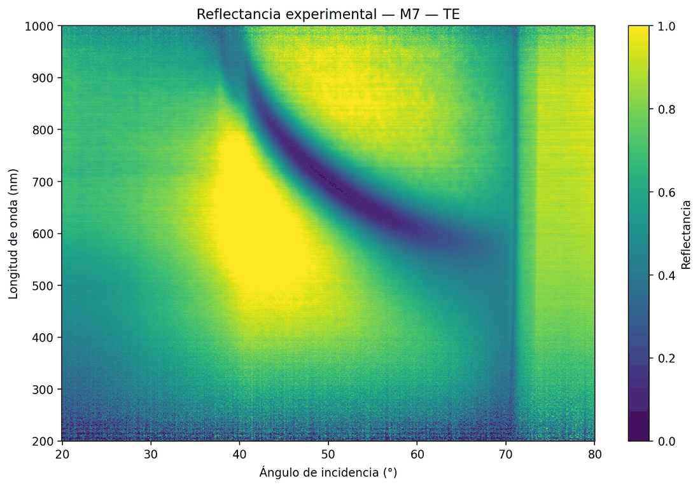

# Reflectance of periodic metal–oxide multilayers

**A surface plasmon can only be excited in TM polarisation. Across six multilayer samples
measured in the Kretschmann geometry, a reflectance minimum showed up in TE — and the same
transfer-matrix model, with no extra physics, already predicted it.**

Franco Maza García · Engineering Physics · Universidad Iberoamericana, Mexico City · April 2026

**→ [Interactive site](https://kankalu.github.io/plasmonics-multilayer/)** ·
[Report, ASE III (PDF, Spanish)](report/ASE_III_luz_reflejada_sistema_periodico_metal_oxido.pdf) ·
[Report, ASE II (PDF, Spanish)](report/ASE_II_teoria_electromagnetica_multicapas.pdf)

*[Versión en español abajo](#reflectancia-de-multicapas-periódicas-metaloxido) ·
[Spanish version below](#reflectancia-de-multicapas-periódicas-metaloxido)*



[](https://github.com/KANKALU/plasmonics-multilayer/actions/workflows/tests.yml)

---

## What this is

Two semesters of work on one question. In ASE II I built the electromagnetic machinery from
Maxwell's equations up to the transfer-matrix method, and used it to simulate gold and Ta₂O₅
stacks on BK7. Two of those simulations produced a reflectance minimum in **TE** polarisation,
where surface-plasmon theory says there should be none. That was left open.

In ASE III I derived the surface-plasmon dispersion relation to establish precisely why TE
should have no such mode at a single metal/dielectric interface, then measured six real samples
to find out whether the minimum was an artefact of the model or something the samples actually do.

**It is something the samples actually do.** The minimum appears only when the final dielectric
layer is thick: absent in M1, M4 and M5, present in M6, M7 and M8, all carrying 70 nm or more of
Ta₂O₅. It behaves the same with gold as with copper, so it does not depend on the metal. This is
consistent with the TE surface mode sustained by polarisation currents in a high-index dielectric
film described by Sun et al., and with the general principle of Mikhailov and Ziegler.

| Sample | Deposited stack | TM plasmon | TE minimum |
|--------|-----------------|:----------:|:----------:|
| M1 | Au(22 nm) / SiO₂(10 nm) | yes | no |
| M4 | Cu(20 nm) / Ta₂O₅(20 nm) | yes | no |
| M5 | Cu(20 nm) / Ta₂O₅(30 nm) | yes | no |
| M6 | Cu(20) / Ta₂O₅(70) / Cu(20) / Ta₂O₅(91 nm) | partial | **yes** |
| M7 | Cu(20 nm) / Ta₂O₅(70 nm) | no | **yes** |
| M8 | Au(20 nm) / Ta₂O₅(70 nm) | no | **yes** |

Every sample sits on a 500 nm quartz substrate, coupled to a BK7 prism with immersion oil.

## The method

The transfer-matrix method treats a stack of `N` planar media, the outer two semi-infinite. The
tangential wavevector is conserved, so with `kx = n₀ sin θ₀` the normal component in medium `l`
is `kz_l = √(n_l² − kx²)`. Each layer contributes

```
M_l = exp(−i k₀ kz_l d_l)/t_l · [[1,                  r_l                ],
                                 [r_l e^(2i k₀ kz_l d_l), e^(2i k₀ kz_l d_l)]]
```

and the stack matrix is the ordered product, from which `r = M₂₁/M₁₁` and `R = |r|²`. The method
is exact — no thin-film or weak-absorption approximation anywhere.

Two implementation details matter more than they look:

- **Branch choice for `kz`.** The square root is taken with `Im kz ≥ 0`, so evanescent waves decay
  rather than grow. Without this the method diverges for metal layers past the critical angle,
  which is exactly the regime the whole experiment lives in.
- **Admittances instead of two Fresnel formulas.** Writing `Y = kz` for TE and `Y = n²/kz` for TM
  collapses both polarisations into one interface expression, which halves the code that can go wrong.

## Measurement

Light from a laser passes a linear polariser and enters a BK7 prism; a detector records the
reflected intensity as the incidence angle is swept from 20° to 80° in 0.1° steps, at 550, 633,
650, 700 and 750 nm, in both polarisations. Intensities are normalised against a reference taken
below the critical angle.

Two facts about the setup that the figures cannot be read without:

- **The BK7/air critical angle at ≈41°** is the calibration landmark. Each measured curve is
  rigidly shifted so its steepest point lands there, correcting the mounting's angular offset.
- **The immersion oil has its own critical angle near 70–75°**, and produces a steep drop at high
  angle that is *not* sample physics. It is not in the modelled stack, so the model does not
  reproduce it. Comparisons are read between 41° and about 70°; the site shades the rest.

## Repository layout

```
src/plasmonics/     the library
  tmm.py            transfer matrix, Fresnel coefficients, angular and 2-D sweeps
  materials.py      n,k table loading and interpolation, with range validation
  samples.py        the six measured stacks
  experiment.py     measurement loading, smoothing, critical-angle alignment
  plotting.py       curves, angle-wavelength maps, layer diagrams
tests/              closed-form physics, an independent algorithm, the data path
notebooks/          one interface → one metal film → the six samples
scripts/            figure regeneration; data export for the site
figures/            comparisons, maps, and figures the code regenerates
data/               optical constants
report/             both written reports (Spanish)
docs/               the GitHub Pages site
```

## Running it

```bash
pip install -r requirements.txt

python scripts/make_figures.py          # regenerate simulated figures
python scripts/export_web_data.py       # rebuild the site's curve data
jupyter lab notebooks/                  # the walkthrough
```

```python
import sys; sys.path.insert(0, "src")
import numpy as np
from plasmonics import default_registry, SAMPLES, reflectance_vs_angle

registry = default_registry()
m7 = SAMPLES["M7"]
theta = np.arange(20, 80.1, 0.1)

n = registry.indices(m7.media, 0.700)                              # λ in micrometres
R_te = reflectance_vs_angle(n, m7.thicknesses, 0.700, theta, "s")
print(f"TE minimum: R = {R_te.min():.3f} at {theta[R_te.argmin()]:.1f}°")
```

## Tests

```bash
PYTHONDONTWRITEBYTECODE=1 python -m pytest tests/
```

362 tests, none of which compare the code to its own earlier output. They come from three places:

- **Closed-form physics.** Fresnel's equations for a bare interface, the Brewster angle, total internal
  reflection, and the Airy formula for a single film at oblique incidence. Plus invariances the method
  must respect: a zero-thickness layer changes nothing, an index-matched layer is invisible, one 70 nm
  layer equals two 35 nm layers, a half-wave film restores the bare result, a quarter-wave film of index
  `sqrt(n0 n2)` reflects nothing.
- **An independent algorithm.** `tests/test_reference.py` solves the same problem by recursive Fresnel,
  folding layers in one at a time and never forming a matrix. The two agree to eleven digits on the six
  real samples and on hundreds of randomly generated stacks with absorbing layers. This is what covers
  the multilayer cases, where no closed form exists.
- **The data path.** Table interpolation, refusal to extrapolate outside a tabulated range, filename
  parsing, and critical-angle alignment against synthetic curves with a decoy plasmon dip.

The suite is mutation-tested: every deliberate change to the physics makes tests fail. Two survive and
should, since reflectance reads `|M21/M11|²` and is blind to a global sign or a global scale factor —
flipping `r` at every interface, and dropping the factor 2 from `t`. Both would matter for
transmittance, which this code does not compute.

Run the tests with `PYTHONDONTWRITEBYTECODE=1`. Edits that leave a file the same size can otherwise
leave a stale `.pyc` behind, and the suite will happily pass against bytecode that no longer matches
the source.

## Notes and limitations

- **Raw measurement files are not in this repository.** They run to several hundred megabytes and
  are not what a reader needs; the processed figures are here, and `experiment.py` documents the
  format exactly (one whitespace-separated row of 601 reflectance values over the 20–80° sweep) so
  the chain stays auditable.
- **Simulated maps stop at 500 nm.** The Ta₂O₅ optical-constant table starts there, so any map of a
  Ta₂O₅ sample is bounded below by the data, not by the measurement, which reaches 200 nm.
  `materials.py` raises rather than silently extrapolating.
- **Discrepancies between measurement and model** are concentrated in the depth and width of the
  minima, and are consistent with deposited thicknesses differing from nominal, plus interface
  roughness the model does not carry.
- **Axis labels in the figures are in Spanish**, as generated during the work.
- Optical constants come from [RefractiveIndex.INFO](https://refractiveindex.info): BK7 and fused
  silica from Schott, Au and Cu from Johnson and Christy (1972), Ta₂O₅ from Bright.

## References

1. S. A. Mikhailov and K. Ziegler, *New Electromagnetic Mode in Graphene*, Phys. Rev. Lett. **99**, 016803 (2007).
2. Z. Sun, X. Zuo, T. Guan and W. Chen, *Artificial TE-mode surface waves at metal surfaces mimicking surface plasmons*, Opt. Express **22**, 4714 (2014).
3. S. A. Maier, *Plasmonics: Fundamentals and Applications*, Springer (2007).
4. H. Raether, *Surface Plasmons on Smooth and Rough Surfaces and on Gratings*, Springer (1988).
5. P. B. Johnson and R. W. Christy, *Optical constants of the noble metals*, Phys. Rev. B **6**, 4370 (1972).

## License

Code under [MIT](LICENSE). The written reports and figures are the author's academic work,
shared for reading and citation.

---
---

# Reflectancia de multicapas periódicas metal–óxido

**Un plasmón superficial sólo se excita en polarización TM. En seis muestras multicapa medidas en
geometría de Kretschmann apareció un mínimo de reflectancia en TE — y el mismo modelo de matriz de
transferencia, sin física adicional, ya lo predecía.**

Franco Maza García · Ingeniería Física · Universidad Iberoamericana, Ciudad de México · abril de 2026

**→ [Sitio interactivo](https://kankalu.github.io/plasmonics-multilayer/)** ·
[Escrito de ASE III (PDF)](report/ASE_III_luz_reflejada_sistema_periodico_metal_oxido.pdf) ·
[Escrito de ASE II (PDF)](report/ASE_II_teoria_electromagnetica_multicapas.pdf)

## De qué se trata

Dos semestres de trabajo sobre una sola pregunta. En ASE II construí el andamiaje electromagnético
desde las ecuaciones de Maxwell hasta el método de matriz de transferencia, y lo usé para simular
pilas de oro y Ta₂O₅ sobre BK7. Dos de esas simulaciones produjeron un mínimo de reflectancia en
polarización **TE**, donde la teoría del plasmón superficial dice que no debe haber ninguno. Quedó
como pregunta abierta.

En ASE III derivé la relación de dispersión del plasmón superficial para establecer con precisión
por qué TE no admite ese modo en una interfaz simple metal/dieléctrico, y después medí seis muestras
reales para averiguar si el mínimo era un artefacto del modelo o algo que las muestras hacen de verdad.

**Es algo que las muestras hacen de verdad.** El mínimo aparece sólo cuando la capa dieléctrica
final es gruesa: no está en M1, M4 ni M5, y sí está en M6, M7 y M8, todas con 70 nm o más de Ta₂O₅.
Se comporta igual con oro que con cobre, así que no depende del metal. Esto es consistente con el
modo TE de superficie sostenido por corrientes de polarización en una película dieléctrica de alto
índice descrito por Sun et al., y con el principio general de Mikhailov y Ziegler.

| Muestra | Capas depositadas | Plasmón TM | Mínimo TE |
|---------|-------------------|:----------:|:---------:|
| M1 | Au(22 nm) / SiO₂(10 nm) | sí | no |
| M4 | Cu(20 nm) / Ta₂O₅(20 nm) | sí | no |
| M5 | Cu(20 nm) / Ta₂O₅(30 nm) | sí | no |
| M6 | Cu(20) / Ta₂O₅(70) / Cu(20) / Ta₂O₅(91 nm) | parcial | **sí** |
| M7 | Cu(20 nm) / Ta₂O₅(70 nm) | no | **sí** |
| M8 | Au(20 nm) / Ta₂O₅(70 nm) | no | **sí** |

Todas las muestras están sobre un sustrato de cuarzo de 500 nm, acoplado al prisma BK7 con aceite
de inmersión.

## El método

El método de matriz de transferencia trata una pila de `N` medios planos, los dos externos
semi-infinitos. La componente tangencial del vector de onda se conserva, así que con
`kx = n₀ sen θ₀` la componente normal en el medio `l` es `kz_l = √(n_l² − kx²)`. Cada capa aporta

```
M_l = exp(−i k₀ kz_l d_l)/t_l · [[1,                  r_l                ],
                                 [r_l e^(2i k₀ kz_l d_l), e^(2i k₀ kz_l d_l)]]
```

y la matriz de la pila es el producto ordenado, del que salen `r = M₂₁/M₁₁` y `R = |r|²`. El método
es exacto: no hay aproximación de película delgada ni de absorción débil en ninguna parte.

Dos detalles de implementación pesan más de lo que parecen:

- **La elección de rama en `kz`.** La raíz se toma con `Im kz ≥ 0`, de modo que las ondas
  evanescentes decaen en vez de crecer. Sin esto el método diverge para capas metálicas más allá
  del ángulo crítico, que es justo el régimen donde vive todo el experimento.
- **Admitancias en lugar de dos fórmulas de Fresnel.** Escribir `Y = kz` para TE y `Y = n²/kz` para
  TM colapsa ambas polarizaciones en una sola expresión de interfaz, lo que reduce a la mitad el
  código que puede fallar.

## La medición

La luz de un láser pasa por un polarizador lineal y entra a un prisma de BK7; un detector registra
la intensidad reflejada mientras el ángulo de incidencia barre de 20° a 80° en pasos de 0.1°, en
550, 633, 650, 700 y 750 nm, en ambas polarizaciones. Las intensidades se normalizan contra una
referencia tomada por debajo del ángulo crítico.

Dos hechos del montaje sin los cuales las gráficas no se pueden leer:

- **El ángulo crítico BK7/aire en ≈41°** es la referencia de calibración. Cada curva medida se
  desplaza rígidamente para que su punto más pronunciado caiga ahí, corrigiendo el desfase angular
  de la montura.
- **El aceite de inmersión tiene su propio ángulo crítico cerca de 70–75°**, y produce una caída
  pronunciada a ángulo alto que *no* es física de la muestra. No está en la pila modelada, así que
  el modelo no la reproduce. Las comparaciones se leen entre 41° y unos 70°; el sitio sombrea el resto.

## Estructura del repositorio

```
src/plasmonics/     la biblioteca
  tmm.py            matriz de transferencia, coeficientes de Fresnel, barridos angulares y 2-D
  materials.py      carga e interpolación de tablas n,k, con validación de rango
  samples.py        las seis pilas medidas
  experiment.py     carga de mediciones, suavizado, alineación al ángulo crítico
  plotting.py       curvas, mapas ángulo–longitud de onda, diagramas de capas
tests/              física con solución cerrada, un algoritmo independiente, los datos
notebooks/          una interfaz → una película metálica → las seis muestras
scripts/            regeneración de figuras; exportación de datos para el sitio
figures/            comparaciones, mapas y figuras que el código regenera
data/               constantes ópticas
report/             ambos escritos
docs/               el sitio de GitHub Pages
```

## Cómo correrlo

```bash
pip install -r requirements.txt

python scripts/make_figures.py          # regenerar figuras simuladas
python scripts/export_web_data.py       # reconstruir los datos del sitio
jupyter lab notebooks/                  # el recorrido
```

```python
import sys; sys.path.insert(0, "src")
import numpy as np
from plasmonics import default_registry, SAMPLES, reflectance_vs_angle

registry = default_registry()
m7 = SAMPLES["M7"]
theta = np.arange(20, 80.1, 0.1)

n = registry.indices(m7.media, 0.700)                              # λ en micrómetros
R_te = reflectance_vs_angle(n, m7.thicknesses, 0.700, theta, "s")
print(f"Mínimo en TE: R = {R_te.min():.3f} a {theta[R_te.argmin()]:.1f}°")
```

## Tests

```bash
PYTHONDONTWRITEBYTECODE=1 python -m pytest tests/
```

362 tests, y ninguno compara el código contra su propia salida anterior. Vienen de tres lados:

- **Física con solución cerrada.** Las ecuaciones de Fresnel para una interfaz desnuda, el ángulo de
  Brewster, la reflexión total interna, y la fórmula de Airy para una película a incidencia oblicua.
  Más las invariancias que el método debe respetar: una capa de espesor cero no cambia nada, una capa
  con el índice del vecino es invisible, una capa de 70 nm equivale a dos de 35 nm, una película de
  media onda restituye el resultado desnudo, y una de cuarto de onda con índice `sqrt(n0 n2)` no
  refleja nada.
- **Un algoritmo independiente.** `tests/test_reference.py` resuelve el mismo problema por recursión de
  Fresnel, metiendo las capas una por una y sin formar ninguna matriz. Los dos coinciden a once dígitos
  en las seis muestras reales y en cientos de pilas generadas al azar con capas absorbentes. Esto es lo
  que cubre los casos multicapa, donde no existe forma cerrada.
- **El camino de los datos.** Interpolación de tablas, negativa a extrapolar fuera del rango tabulado,
  parseo de nombres de archivo, y alineación al ángulo crítico contra curvas sintéticas con un mínimo
  plasmónico señuelo.

La suite está probada por mutación: todo cambio deliberado a la física hace fallar tests. Dos
sobreviven, y deben hacerlo: la reflectancia lee `|M21/M11|²` y es ciega a un signo global o a un
factor de escala global — voltear `r` en cada interfaz, y quitar el factor 2 de `t`. Ambos importarían
para la transmitancia, que este código no calcula.

Corre los tests con `PYTHONDONTWRITEBYTECODE=1`. Las ediciones que dejan el archivo del mismo tamaño
pueden dejar un `.pyc` obsoleto, y la suite pasará feliz contra bytecode que ya no corresponde al
fuente.

## Notas y limitaciones

- **Los archivos crudos de medición no están en este repositorio.** Llegan a varios cientos de
  megabytes y no son lo que un lector necesita; las figuras procesadas sí están, y `experiment.py`
  documenta el formato con precisión (un renglón de 601 valores de reflectancia separados por
  espacios sobre el barrido de 20° a 80°) para que la cadena siga siendo auditable.
- **Los mapas simulados se detienen en 500 nm.** La tabla de constantes ópticas del Ta₂O₅ empieza
  ahí, así que cualquier mapa de una muestra con Ta₂O₅ está acotado por abajo por los datos, no por
  la medición, que llega a 200 nm. `materials.py` lanza un error en vez de extrapolar en silencio.
- **Las discrepancias entre medición y modelo** se concentran en la profundidad y el ancho de los
  mínimos, y son consistentes con espesores depositados distintos del nominal, más la rugosidad de
  las interfaces que el modelo no incluye.
- Las constantes ópticas vienen de [RefractiveIndex.INFO](https://refractiveindex.info): BK7 y
  sílice fundida de Schott, Au y Cu de Johnson y Christy (1972), Ta₂O₅ de Bright.

## Licencia

Código bajo [MIT](LICENSE). Los escritos y las figuras son trabajo académico del autor, compartidos
para lectura y cita.
